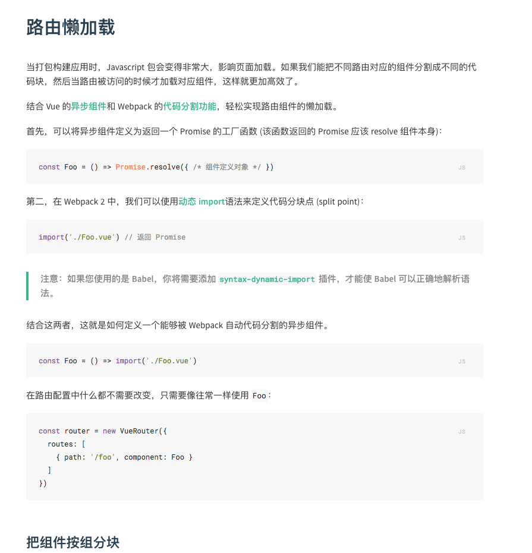

# vue-router-lazy-load 路由懒加载

> vue 路由懒加载

## Build Setup

``` bash
# install dependencies
yarn install 或 npm install

# serve with hot reload at localhost:8080
npm run dev

# build for production with minification
npm run build

# build for production and view the bundle analyzer report
npm run build --report

# build for production after,open express node server
npm run server

```


接下来提供始终四种方法 来实现vue路由懒加载

+	Webpack动态加载import (webpack > 2.4)

```js
const Index = () => import('@/views/index')
const Foo = () => import('@/components/foo/index')
const Bar = () => import('@/components/bar/index')
```


+  AMD的标准实现

```js
// AMD
const Index = resolve => require(['../views/index.vue'], resolve)
const Foo = resolve => require(['../components/foo/index.vue'], resolve)
const Bar = resolve => require(['../components/bar/index.vue'], resolve)

```


+  Webpack的特殊语法 用来代码分块

```
const Index = r => require.ensure([], () => r(require('../views/index.vue')), 'index')
const Foo = r => require.ensure([], () => r(require('../components/foo/index.vue')), 'foo')
const Bar = r => require.ensure([], () => r(require('../components/bar/index.vue')), 'bar')

```


+ vue官方提供的[路由懒加载](https://router.vuejs.org/zh-cn/advanced/lazy-loading.html)方法，定义[异步组件](https://cn.vuejs.org/v2/guide/components.html#%E5%BC%82%E6%AD%A5%E7%BB%84%E4%BB%B6)




